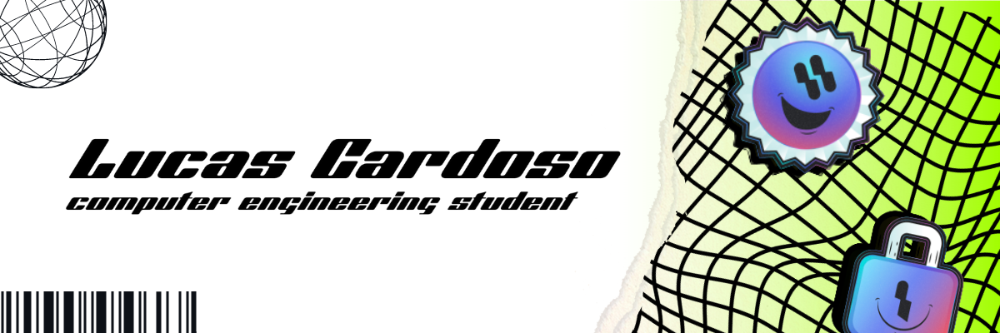

<picture>
  <source media="(prefers-color-scheme: dark)" srcset="1.png">
  
</picture>
<h1 >Hello 👋, my name is Lucas</h1>

### I'm a Computer Engineering student from Unicamp

- 🌱 Currently learning **Web Development**
- 🤔 Passionate about **Machine Learning**
- ❤️ Looking to collaborate on **Beneficent Programming Classes**

### Contact me

   

### Knowlegde
      

          

<a href="https://github.com/lcardosott">

